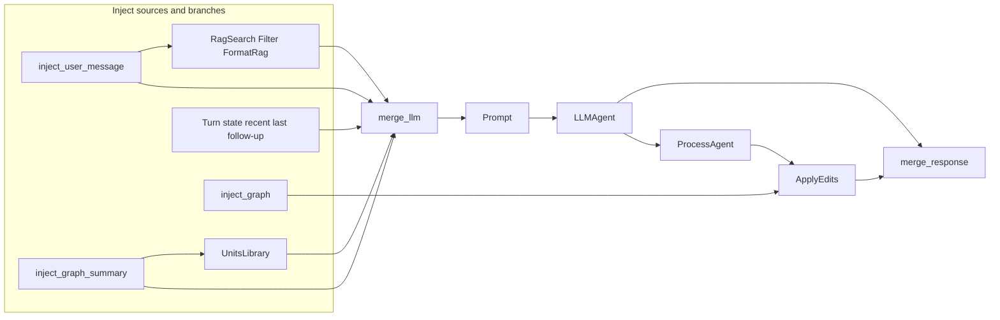

# Workflow Designer role

The **Workflow Designer** is the TaskVector assistant that edits the **process graph** from natural language: add/remove/connect units, parameters, and related edits.

| Item | Location |
|------|----------|
| Role config (`tools`, `chat`, LLM defaults) | `assistants/roles/workflow_designer/role.yaml` |
| Chat process graph (canonical JSON) | `assistants/roles/workflow_designer/workflow_designer_workflow.json` |
| `initial_inputs` builders for that graph | `assistants/roles/workflow_designer/workflow_inputs.py` (`build_assistant_workflow_initial_inputs`, language helpers, retry inputs) |
| Default system prompt text | `assistants/prompts.py` → `WORKFLOW_DESIGNER_SYSTEM`; template wiring in `config/prompts/workflow_designer.json` |
| Flet chat turn (stream, apply, follow-ups) | `gui/chat/role_turns/workflow_designer/` — see `gui/chat/role_turns/workflow_designer/README.md` |
| Shared runner for any role chat JSON | `gui/chat/assistant_workflow/run.py` → `run_assistant_workflow()` |

Resolve the workflow file path with `assistants.roles.workflow_path.get_role_chat_workflow_path` (uses `role.yaml` `chat.workflow`, or the default filename for `workflow_designer`).

---

## Using it in the app

1. Enable the role in **`role.yaml`** (`chat.enabled`, `chat.workflow` if you override the filename).
2. In the Flet assistants UI, pick **Workflow Designer** (dropdown order: `list_chat_dropdown_role_ids()` and `CHAT_MAIN_ASSISTANT_ROLE_IDS` in `assistants/roles/registry.py`; feature flags in `assistants/roles/chat_config.py`).
3. Optional **`chat.features`**: `graph_canvas` enables dev **Run current graph**; `create_chat_title` runs the first-message title workflow (`create_filename.json`).

The handler builds `initial_inputs` and `unit_param_overrides`, then calls `run_assistant_workflow()` (default path = Workflow Designer graph unless **Run current graph** is on).

---

## What the chat graph does

One-line data flow:

**Inject sources (user message, graph summary, turn state, …) + UnitsLibrary + (RagSearch → Filter → FormatRagPrompt) → Merge → Prompt → LLMAgent → ProcessAgent → ApplyEdits → Merge (response)**

- **UnitsLibrary** consumes the graph summary (from **GraphSummary** / `inject_graph`) and feeds the merged prompt.
- **RAG**: `inject_user_message` drives **RagSearch** → **Filter** (data_bi, score ≥ 0.48) → **FormatRagPrompt** → merge. Callers do **not** inject `units_library` or `rag_context` directly; the graph wires them. **RagSearch** `persist_dir` / `embedding_model` use `settings.rag_index_data_dir` and `settings.rag_embedding_model` in JSON; resolved at run time via `units/canonical/app_settings_param.py`.
- The app passes **`unit_param_overrides`** for `rag_search`, `rag_filter`, and `format_rag` so behavior matches `get_rag_context()`.



---

## Unit topology (main chain)

| Unit / id | Type | Role |
|-----------|------|------|
| `inject_user_message` | Inject | User text → merge + RagSearch. |
| `inject_graph_summary` | Inject | Graph summary dict → merge + UnitsLibrary. |
| `units_library` | UnitsLibrary | `graph_summary` → formatted list → merge. |
| `rag_search` → `rag_filter` → `format_rag` | RagSearch, Filter, FormatRagPrompt | Query → table → score filter → “Relevant context…” → merge. |
| `inject_turn_state`, `inject_recent_changes_block`, `inject_last_edit_block`, `inject_follow_up_context` | Inject | Context lines → merge (`in_4`–`in_7`). |
| `inject_graph` | Inject | Current graph dict → **ApplyEdits** (`process.graph`). |
| `merge_llm` | Merge | `in_0`…`in_7` → single `data` for **Prompt**. |
| `prompt_llm` | Prompt | Template + `data` → system/user messages (`config/prompts/workflow_designer.json`). |
| `llm_agent` | LLMAgent | LLM call; params overridable (see below). |
| `parser` | ProcessAgent | Parses LLM `action` → edits (+ optional tool requests). |
| `process` | ApplyEdits | Applies edits to graph. |
| `merge_response` | Merge | Single **`data`** object for the GUI. |

---

## Running the graph yourself

### Python (`runtime.run.run_workflow`)

```python
from pathlib import Path
from runtime.run import run_workflow
from assistants.process_assistant import graph_summary

path = Path("assistants/roles/workflow_designer/workflow_designer_workflow.json")
current_graph = {"units": [], "connections": []}

initial_inputs = {
    "inject_user_message": {"data": user_message},
    "inject_graph_summary": {"data": graph_summary(current_graph)},
    "inject_turn_state": {"data": turn_state_line},
    "inject_recent_changes_block": {"data": recent_changes_text_or_empty},
    "inject_last_edit_block": {"data": self_correction_or_empty},
    "inject_graph": {"data": current_graph},
}
# Optional Phase 2:
# initial_inputs["inject_follow_up_context"] = {"data": follow_up_text}

unit_param_overrides = {
    "llm_agent": {"model_name": "...", "provider": "...", "host": "..."},
    "rag_search": {"top_k": 10},
}

outputs = run_workflow(
    path,
    initial_inputs=initial_inputs,
    unit_param_overrides=unit_param_overrides,
    format="dict",
)
```

Use **`build_assistant_workflow_initial_inputs`** from `workflow_inputs.py` in the app instead of hand-rolling every field.

### CLI

```bash
python -m runtime assistants/roles/workflow_designer/workflow_designer_workflow.json --format dict --initial-inputs @inputs.json
```

---

## `initial_inputs` (Inject ids)

For each inject unit id: `initial_inputs[id] = {"data": value}`.

| Inject id | Value |
|-----------|--------|
| `inject_user_message` | User message string (merge + RagSearch). |
| `inject_graph_summary` | Summary dict from `graph_summary(graph)` (merge + UnitsLibrary). |
| `inject_turn_state` | One-line turn state (e.g. “Last action: none.”). |
| `inject_recent_changes_block` | Recent changes text or `""`. |
| `inject_last_edit_block` | Self-correction after a failed apply, or `""`. |
| `inject_follow_up_context` | Optional: file / RAG / web / browse / code-block context for a follow-up run. |
| `inject_graph` | Current process graph dict. |

Merge **`params.keys`** order must match wiring: `in_0` = user message … through `in_7` = follow-up context when present.

---

## `merge_response.data` (what the GUI reads)

Prefer the packaged helper **`run_assistant_workflow()`**, which normalizes **`merge_response.data`**. If you read `outputs` yourself:

```python
response = outputs.get("merge_response", {}).get("data", {})
reply = response.get("reply")
result = response.get("result")
status = response.get("status")
graph = response.get("graph")
diff = response.get("diff")
parser_output = response.get("parser_output")
```

When `parser_output` includes side channels (`read_file`, `rag_search`, `web_search`, `browse_url`, …), the **handler** runs the follow-up loop and re-invokes the workflow with `inject_follow_up_context` filled.

---

## LLMAgent overrides

Pass `unit_param_overrides["llm_agent"]` to match app / profile settings, e.g.:

- `workflow_designer_ollama_model` → `model_name`
- `workflow_designer_llm_provider` → `provider`
- `workflow_designer_ollama_host` → `host`

(Names align with `role.yaml` / settings; exact keys depend on your executor merge.)

---

## Web search and browse (standalone tool graphs)

When the model requests **web_search** or **browse**, the GUI runs small workflows (paths from `assistants/tools/<id>/tool.yaml`):

| Workflow | `initial_inputs` | Read output from |
|----------|------------------|-------------------|
| `assistants/tools/web_search/web_search.json` | `{"inject_query": {"data": "<query>"}}` | `outputs["web_search"]["out"]` |
| `assistants/tools/browse/browser.json` | `{"inject_url": {"data": "<url>"}}` | `outputs["beautifulsoup"]["out"]` |

Call **`register_web_units()`** (`units.web`) before `run_workflow()` so `web_search`, `browser`, and `beautifulsoup` units exist. Optional deps: `duckduckgo-search`, `requests`, `beautifulsoup4`.

---

## Apply errors and self-correction

If **ApplyEdits** fails, the next run should pass error context through **`inject_last_edit_block`** and an updated **`inject_turn_state`** so the model can recover. The Flet handler stores `last_apply_result` and rebuilds inputs via `workflow_inputs.build_self_correction_retry_inputs` where applicable.

---

## See also

- **All roles** (YAML schema, creating a role): [`../README.md`](../README.md)
- **Flet handler** (streaming, apply, dev graph): [`../../../gui/chat/role_turns/workflow_designer/README.md`](../../../gui/chat/role_turns/workflow_designer/README.md)
- **Runtime** (`run_workflow`, formats): [`../../../runtime/README.md`](../../../runtime/README.md)
